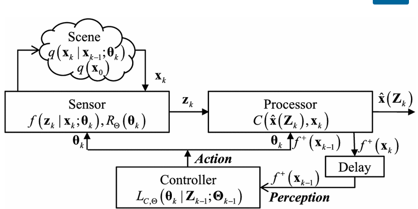

## Cognitive Radar Framework for Target Tracking
In my previous write-up, I discussed the paper written as a follow-up to this paper. For context, Paper 2 focused on an experiment implemented on a software-defined radar platform with the goal of demonstrating cognitive radar as applied to target tracking. This paper, provides the framework upon which design and implement cognitive systems. The technical contribution consists of a vocabulary, a model, and a mathematical framework which leverages Bayesian statistics, in order to further research and develop cognitive radar (CR) systems.

The model of the CR sensor/processor system is given below for reference

The Sensor is characterized as that which observes the Scene. The Scene contains the Target in addition to the Environment. The current Target State is denoted by $\mathbf{x_k}$. The observations, $\mathbf{Z_k}$, are fed to the Processor which is tasked with reducing the observations to a set of measurements, $\mathbf{\hat{x}_k}(\mathbf{Z_k})$, which are an estimate of the Target State.

The conditional pdf of $\mathbf{x_k}$ is determined using a Markov motion model recursively generated as a function of the predicted density and the previous conditional or posterior pdf.

The objective of the Controller is, given measurements and theirs associated densities up to the previous time $k - 1$, minimize a Loss function that uses the system objectives to balance Sensor and Processor Cost appropriately. The argument which minimizes the Loss function is the set of Sensor/Processor parameters at time $k$.

My interest in the topic stems from related applications at work and adapting the generalized framework to different problems. In reading the introductory material the taxonomy became clearer. In a CR system, the defining characteristic is a Control module that seeks to optimize some system objective based on perceived characteristics of the sensed scene. In these papers Dr. Bell, _et al._, focus on target tracking estimates and minimizing associated uncertainty.

Other objectives could be imagined where the parameters of the Sensor are mostly fixed and the Processor becomes the sub-system to optimize. In modern radar systems, the amount of incoming data can be very large - on the order of hundreds of GB/second - perhaps more for high-definition imaging systems. In addition, there can be many corruptions to the desired signal, including the ubiquitous thermal noise, as well as ground clutter, possibly sources of interference,
accidental or intentional. Each of these can be modeled and processed in a way that maximizes the Signal to Interference plus Noise ratio. However, the more sophisticated processing techniques require more computational throughput, more memory, and more latency. I would be interested in extensions of this work that focus not on transmitted waveform parameters, but rather, Processor resource constraints and subsequent algorithm selection.

## Citation
K. L. Bell, C. J. Baker, G. E. Smith, J. T. Johnson and M. Rangaswamy, "Cognitive Radar Framework for Target Detection and Tracking," in IEEE Journal of Selected Topics in Signal Processing, vol. 9, no. 8, pp. 1427-1439, Dec. 2015.

